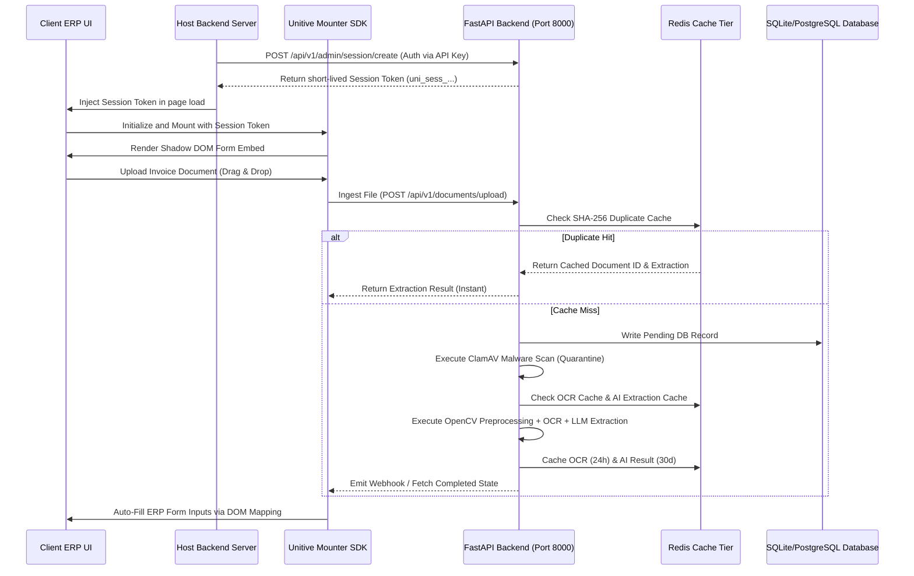

# Unitive Form Automation: Plugin Integration & Production Readiness Guide

This guide details the integration architecture, mounting protocol, and production readiness requirements for embedding the Unitive Form Automation platform as a plugin widget inside third-party Enterprise Resource Planning (ERP) systems (e.g., SAP, Oracle NetSuite, Microsoft Dynamics, Zoho) and modern web applications.

---

## 1. Architectural Integration Topology

The Unitive module runs as a self-contained, containerized service that can be embedded into target ERP screens using a lightweight JavaScript Mounter SDK. It communicates asynchronously with the FastAPI backend, utilizing a Redis caching tier for high-performance and cost optimization.



---

## 2. Mounting Protocol: JavaScript SDK Integration

To load the Unitive plugin directly into any web dashboard or ERP page, embed the following script block. The SDK mounts inside a isolated **Shadow DOM** to prevent CSS styling contamination or collisions with the host ERP.

### A. CDN Bundle Script Inclusion
Place the following script tag in the HTML head of your ERP page:

```html
<script src="https://cdn.unitive.in/sdk/v1/mounter.js" defer></script>
```

### B. Secure Token Handshake (No API Keys in URL)
Avoid putting sensitive API keys in client-side script code or iframe query parameters. 
First, make a server-to-server request from your ERP's backend application to retrieve a short-lived, origin-locked bearer session token:

```http
POST /api/v1/admin/session/create HTTP/1.1
Host: api.unitive.in
Content-Type: application/json
Authorization: Bearer <Your_Secret_Live_API_Key>

{
  "api_key": "uni_live_dev1234567890abcdef...",
  "allowed_origin": "https://erp.yourcompany.com"
}
```

**Response:**
```json
{
  "session_token": "uni_sess_902abc123fed...",
  "expires_in_sec": 900,
  "allowed_origin": "https://erp.yourcompany.com",
  "permissions": ["read", "write"]
}
```

### C. Initialization (Vanilla JavaScript Example)
Create a target container element and initialize the widget with the short-lived token:

```html
<div id="unitive-automation-root"></div>

<script>
  window.addEventListener('DOMContentLoaded', () => {
    UnitiveWidget.init({
      containerId: 'unitive-automation-root',
      sessionToken: 'uni_sess_902abc123fed...', // Short-lived session token (Point 1 & 4)
      backendUrl: 'https://api.unitive.in',
      theme: 'dark', // 'dark' | 'light' | 'boxy'
      
      // Heartbeats & Lifecycle events (Point 6 & 16)
      onWidgetReady: () => console.log('[Unitive] Widget is ready.'),
      onAuthSuccess: (data) => console.log('[Unitive] Authenticated in workspace:', data.workspace),
      onUploadStarted: (data) => console.log(`[Unitive] Uploading: ${data.filename}`),
      onUploadProgress: (data) => console.log(`[Unitive] File: ${data.filename}, Stage: ${data.stage}`),
      onOCRStarted: (data) => console.log('[Unitive] OCR Extraction starting...'),
      onAIStarted: (data) => console.log('[Unitive] SLM parsing initialized...'),
      onComplete: (data) => console.log('[Unitive] Extraction success:', data.extracted_json),
      onFillComplete: (mappings) => console.log('[Unitive] Form inputs populated:', mappings),
      onDisconnected: () => console.warn('[Unitive] Connection lost.'),
      onReconnected: () => console.log('[Unitive] Connection restored.'),
      onError: (err) => console.error('[Unitive] Error:', err.message)
    });
  });
</script>
```

---

## 3. Web Framework Integration Snippets

### A. React Integration
```jsx
import React, { useEffect, useRef } from 'react';

export const UnitiveWidgetComponent = ({ sessionToken }) => {
  const containerRef = useRef(null);
  const widgetRef = useRef(null);

  useEffect(() => {
    if (containerRef.current) {
      window.UnitiveWidget.init({
        containerId: 'unitive-widget-container',
        sessionToken: sessionToken,
        backendUrl: 'https://api.unitive.in',
        theme: 'light',
        onComplete: (data) => {
          console.log('React Callback complete:', data);
        }
      }).then(widget => {
        widgetRef.current = widget;
      });
    }

    return () => {
      if (widgetRef.current) {
        widgetRef.current.unmount();
      }
    };
  }, [sessionToken]);

  return <div id="unitive-widget-container" ref={containerRef} />;
};
```

### B. Angular Integration
```typescript
import { Component, OnInit, OnDestroy, Input } from '@angular/core';

declare var UnitiveWidget: any;

@Component({
  selector: 'app-unitive-widget',
  template: `<div id="unitive-widget-container"></div>`
})
export class UnitiveWidgetComponent implements OnInit, OnDestroy {
  @Input() sessionToken!: string;
  private widgetHandle: any;

  ngOnInit() {
    this.widgetHandle = UnitiveWidget.init({
      containerId: 'unitive-widget-container',
      sessionToken: this.sessionToken,
      backendUrl: 'https://api.unitive.in',
      theme: 'dark',
      onComplete: (data: any) => console.log('Angular integration complete', data)
    });
  }

  ngOnDestroy() {
    if (this.widgetHandle) {
      this.widgetHandle.unmount();
    }
  }
}
```

### C. Vue Integration
```html
<template>
  <div id="unitive-widget-container"></div>
</template>

<script>
export default {
  props: {
    sessionToken: { type: String, required: true }
  },
  data() {
    return { widgetHandle: null };
  },
  mounted() {
    this.widgetHandle = window.UnitiveWidget.init({
      containerId: 'unitive-widget-container',
      sessionToken: this.sessionToken,
      backendUrl: 'https://api.unitive.in',
      onComplete: (data) => this.$emit('complete', data)
    });
  },
  beforeUnmount() {
    if (this.widgetHandle) {
      this.widgetHandle.unmount();
    }
  }
};
</script>
```

---

## 4. Content Security Policy (CSP) Recommendations

To mitigate script injection, cross-site scripting (XSS), and clickjacking attacks, load the widget with the following HTTP Security Headers on the parent page hosting the frame:

```http
Content-Security-Policy: 
  frame-ancestors 'self' https://*.unitive.in https://your-erp-domain.com;
  script-src 'self' https://cdn.unitive.in;
  connect-src 'self' https://api.unitive.in;
  img-src 'self' data: https://cdn.unitive.in;
```

* **frame-ancestors**: Restricts widget rendering to explicitly verified parent host domains.
* **script-src / connect-src**: Limits script compilation and network requests to verified API gateways.

---

## 5. Webhook Reliability Architecture

The Unitive backend provides a robust callback framework to notify target systems upon invoice analysis completion.

* **Signature Verification**: Every webhook request includes an `X-Signature` header computed as: `HMAC-SHA256(webhook_secret, payload_bytes)`. Verification must be enforced on your gateway.
* **Exponential Backoff**: If the target server is down or returns non-2xx codes, the dispatcher retries automatically up to **5 times** over a 24-hour window, delaying calls progressively: `multiplier * (2 ** attempt_number)` seconds.
* **Dead-Letter Queue (DLQ)**: Failed deliveries after 5 attempts are pushed to a Dead-Letter Queue database collection, reviewable inside the Security Control & Telemetry HUD.
* **Auto-Disable Switch**: If a workspace's webhook endpoint fails 5 consecutive times, notifications are paused to protect the network, and an administrative lock log is written.

---

## 6. Async Job REST API

For batch server-to-server file integrations, decouple processing state from storage retrieval using the Async Jobs API:

### A. Upload Document to Queue
* **Endpoint**: `POST /api/v1/documents/jobs/upload`
* **Headers**: `X-API-Key`: `<Your secret key>`
* **Response**:
```json
{
  "job_id": "job_a3f890c2-3921-4a3b-9eef-410a5697d2aa",
  "status": "pending",
  "created_at": "2026-06-26T11:42:00Z"
}
```

### B. Poll Job Status
* **Endpoint**: `GET /api/v1/documents/jobs/{job_id}/status`
* **Response**:
```json
{
  "job_id": "job_a3f890c2-3921-4a3b-9eef-410a5697d2aa",
  "status": "processing",
  "progress_stage": "ocr" // "pending" | "quarantine" | "ocr" | "extraction" | "completed" | "failed"
}
```

### C. Fetch Final Extraction Result
* **Endpoint**: `GET /api/v1/documents/jobs/{job_id}/result`
* **Response (If Pending/Processing - 202 Accepted)**:
```json
{
  "job_id": "job_a3f890c2-3921-4a3b-9eef-410a5697d2aa",
  "status": "processing",
  "message": "Extraction is still in progress. Please check status again."
}
```
* **Response (If Completed - 200 OK)**:
```json
{
  "job_id": "job_a3f890c2-3921-4a3b-9eef-410a5697d2aa",
  "status": "completed",
  "extracted_json": {
    "vendor_name": "Global Services Ltd",
    "invoice_number": "INV-2026-905",
    "total_amount": "14,500.00"
  },
  "confidence_score": 0.95
}
```

---

## 7. Data Protection & Encryption Architecture

* **Transit Protection**: Force TLS 1.3 protocols with secure cipher suites (e.g., `ECDHE-ECDSA-AES128-GCM-SHA256`) for all client-to-server and server-to-server REST traffic.
* **Storage Protection**: Uploaded assets stored in Object Storage (e.g. AWS S3) are encrypted at rest using envelope encryption with Customer Managed Keys in AWS KMS (SSE-KMS).
* **Database Encryption**: Sensitive field parameters (like client contact emails, mobile phone details, PAN numbers) are encrypted at the column level in SQL databases using authenticated symmetric cryptography (AES-256-GCM).
* **Secrets Protection**: API credentials, HMAC signature secrets, and cloud access keys are loaded dynamically from AWS Secrets Manager or HashiCorp Vault. Default config values in `config.py` act as fail-safes and are never checked into version control.

---

## 8. Multi-Region Data Residency Routing

For compliance with data localization directives (e.g. EU GDPR, Indian DPDP Act, Singapore PDPA), Unitive Technologies supports regional storage and processing nodes:

```
                  [ Global Ingress DNS Route ]
                               |
       +-----------------------+-----------------------+
       |                       |                       |
[ India Node ]        [ Singapore Node ]        [ Europe Node ]
 - AP-South-1          - AP-Southeast-1          - EU-Central-1
 - Local Database      - Local Database          - Local Database
 - Local Processing     - Local Processing        - Local Processing
```

Regional client workloads are mapped automatically to localized processing endpoints, ensuring document files never exit their designated legal jurisdiction.

---

## 9. Service Level Agreement (SLA) & Recovery Commitments

Unitive Technologies guarantees enterprise-grade availability and resilience:

* **Uptime Target**: 99.9% monthly availability for the core API gateway and widget hosting services (excluding planned maintenance).
* **Response Time Commitments**: API response latency (excluding LLM execution) is guaranteed at **P95 < 500ms**.
* **Backup Frequency**: Automated database and object storage snapshots are captured **daily** and retained for **30 days** across multiple availability zones.
* **Disaster Recovery Objectives**:
  * **RTO (Recovery Time Objective)**: < 4 Hours.
  * **RPO (Recovery Point Objective)**: < 1 Hour.
