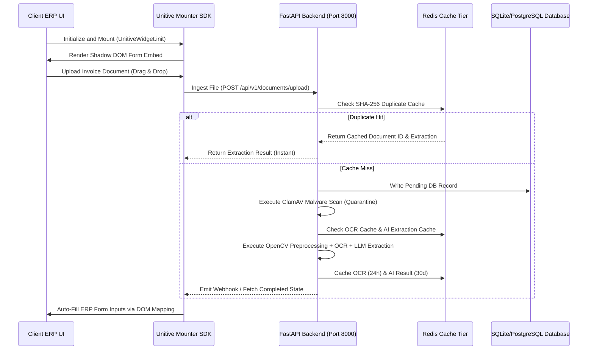

# Unitive Form Automation: Plugin Integration & Production Readiness Guide

This guide details the integration architecture, mounting protocol, and production readiness requirements for embedding the Unitive Form Automation platform as a plugin widget inside third-party Enterprise Resource Planning (ERP) systems (e.g., SAP, Oracle NetSuite, Microsoft Dynamics, Zoho) and modern web applications.

---

## 1. Architectural Integration Topology

The Unitive module runs as a self-contained, containerized service that can be embedded into target ERP screens using a lightweight JavaScript Mounter SDK. It communicates asynchronously with the FastAPI backend, utilizing a Redis caching tier for high-performance and cost optimization.



---

## 2. Mounting Protocol: JavaScript SDK Integration

To load the Unitive plugin directly into any web dashboard or ERP page, embed the following script block. The SDK mounts inside a isolated **Shadow DOM** to prevent CSS styling contamination or collisions with the host ERP.

### A. CDN Bundle Script Inclusion
Place the following script tag in the HTML head of your ERP page:

```html
<script src="https://cdn.unitive.in/sdk/v1/mounter.js" defer></script>
```

### B. Initialization & DOM Mount Selector
Create a target container element where the widget should render and initialize the plugin:

```html
<!-- Container element inside your ERP Form wrapper -->
<div id="unitive-automation-root"></div>

<script>
  window.addEventListener('DOMContentLoaded', () => {
    // Initialize the Unitive Widget
    UnitiveWidget.init({
      containerId: 'unitive-automation-root',
      apiKey: 'uni_live_dev1234567890abcdef...', // Hashed on the backend
      workspaceId: 'ws_default_workspace',
      targetFormUrl: window.location.href, // Auto-detect current ERP input form fields
      theme: 'dark', // 'dark' | 'light' | 'boxy'
      onUploadStarted: (filename) => {
        console.log(`[Unitive] Ingesting document: ${filename}`);
      },
      onProcessComplete: (data) => {
        console.log('[Unitive] Extraction completed successfully:', data.extracted_json);
      },
      onFillComplete: (result) => {
        console.log('[Unitive] ERP form fields successfully mapped and filled:', result);
      },
      onError: (error) => {
        console.error('[Unitive] Ingestion error:', error.message);
      }
    });
  });
</script>
```

### C. Standard JS Mounter Implementation (SDK Source)
The underlying `mounter.js` code dynamically constructs the iframe or Shadow DOM tree:

```javascript
// mounter.js - Unitive Technologies SDK Core
(function(window) {
  const UnitiveWidget = {
    init: function(config) {
      const container = document.getElementById(config.containerId);
      if (!container) {
        console.error('Unitive Widget: Container ID element not found.');
        return;
      }

      // Create Shadow DOM to encapsulate styling
      const shadowRoot = container.attachShadow({ mode: 'open' });

      // Embed widget stylesheet
      const link = document.createElement('link');
      link.rel = 'stylesheet';
      link.href = 'https://cdn.unitive.in/sdk/v1/styles.css';
      shadowRoot.appendChild(link);

      // Create Iframe connector pointing to static dist dashboard
      const iframe = document.createElement('iframe');
      iframe.src = `https://dashboard.unitive.in/?embed=true&apiKey=${config.apiKey}&theme=${config.theme}&targetUrl=${encodeURIComponent(config.targetFormUrl)}`;
      iframe.style.width = '100%';
      iframe.style.height = '600px';
      iframe.style.border = 'none';
      iframe.style.borderRadius = '8px';
      iframe.style.boxShadow = '0 4px 12px rgba(0, 0, 0, 0.1)';
      
      shadowRoot.appendChild(iframe);

      // Listener for child postMessage actions (e.g. form filling commands)
      window.addEventListener('message', (event) => {
        if (event.origin !== 'https://dashboard.unitive.in') return;
        
        const payload = event.data;
        if (payload.action === 'UNITIVE_FILL_FORM') {
          this.executeFormFilling(payload.mappings);
          if (config.onFillComplete) config.onFillComplete(payload.mappings);
        }
      });
    },

    executeFormFilling: function(mappings) {
      // Direct DOM traversal & mapping inside Host ERP Form
      for (const [selector, value] of Object.entries(mappings)) {
        const input = document.querySelector(`[name="${selector}"], #${selector}, .form-control-${selector}`);
        if (input) {
          input.value = value;
          // Dispatch input event to trigger React/Angular/Vue change tracking inside Host ERP
          input.dispatchEvent(new Event('input', { bubbles: true }));
          input.dispatchEvent(new Event('change', { bubbles: true }));
        }
      }
    }
  };

  window.UnitiveWidget = UnitiveWidget;
})(window);
```

---

## 3. Production Backend Integration APIs

For server-to-server calls (e.g., custom batch workflows outside the UI), your middleware will interface directly with the FastAPI REST API.

### A. Document Upload & Ingestion
Upload invoice files for async virus scanning, OCR, and SLM structural parsing.

* **Endpoint**: `POST /api/v1/documents/upload`
* **Headers**: 
  * `X-API-Key`: `<Your API key>`
  * `Content-Type`: `multipart/form-data`
* **Response**:
```json
{
  "id": "doc_a3f890c2-3921-4a3b-9eef-410a5697d2aa",
  "filename": "invoice_12045.pdf",
  "mime_type": "application/pdf",
  "status": "pending",
  "confidence_score": 0.0,
  "created_at": "2026-06-26T11:42:00Z"
}
```

### B. Fetch Extraction Result (Deduplicated Cache Check)
Fetch the processed structural data. This endpoint queries the **Frequently Downloaded Files cache** (`doc:result:<doc_id>`) instantly avoiding SQL lookups.

* **Endpoint**: `GET /api/v1/documents/{doc_id}`
* **Headers**: `X-API-Key`: `<Your API key>`
* **Response**:
```json
{
  "id": "doc_a3f890c2-3921-4a3b-9eef-410a5697d2aa",
  "filename": "invoice_12045.pdf",
  "status": "completed",
  "extracted_json": {
    "vendor_name": "Global Services Ltd",
    "invoice_number": "INV-2026-905",
    "total_amount": "14,500.00",
    "mobile_number": "9876543110",
    "email": "biller@global.com"
  },
  "confidence_score": 0.95
}
```

---

## 4. Webhook Registry & Secure HMAC Callbacks

To avoid polling client-side, the backend registers a webhook target URL. When parsing finishes, the server issues an HTTP `POST` containing the JSON payload and a custom `X-Signature` validation header.

### HMAC Payload Signature Verification (NodeJS / NestJS Example)
Your ERP webhook gateway should verify payload signatures to prevent Spoofing attacks:

```javascript
const crypto = require('crypto');

function verifyWebhook(req, res, next) {
  const incomingSignature = req.headers['x-signature'];
  const webhookSecret = process.env.UNITIVE_WEBHOOK_SECRET; // Loaded from admin settings

  const computedHash = crypto
    .createHmac('sha256', webhookSecret)
    .update(JSON.stringify(req.body))
    .digest('hex');

  if (computedHash === incomingSignature) {
    next(); // Safe to process
  } else {
    res.status(401).send('Security signature verification failed.');
  }
}
```

---

## 5. Caching Strategy Configuration Matrix

For high availability production readiness, ensure that the cache expiration strategy in [cache_service.py](file:///C:/Users/srira/Desktop/aiproject/aiproject/backend/app/services/cache_service.py) is connected to a clustered Redis server.

| Cache Key Group | TTL Expiration | Invalidation Events | Purpose |
| :--- | :--- | :--- | :--- |
| `workspace:<id>:settings` | `10 Minutes` | Configuration Save / Update | Caches Allowed Extensions & settings |
| `apikey:hash:<hash>` | `10 Minutes` | Key rotation, deletion, revocation | Offloads DB auth queries |
| `prompt:<name>` | `1 Hour` | Prompt templates file edits | Reuses parsed compiler tokens |
| `ocr:<file_hash>` | `24 Hours` | Manual reprocessing request | Bypasses OCR text mapping |
| `ai:result:<hash>` | `30 Days` | Prompt version bump (`v1` to `v2`) | Bypasses LLM cloud API costs |
| `embedding:hash:<hash>`| `30 Days` | None (fixed sentence model) | Avoids transformer CPU latency |
| `doc:result:<doc_id>` | `10 Minutes` | Document deletion, human review | Speeds up retrieval/downloads |
| `ratelimit:requests` | `1 Minute` | Automated clock ticking | Implements rate bucket resets |

---

## 6. Enterprise Production Readiness Checklist

Before moving the Unitive plugin to staging/production, satisfy this readiness checklist:

### A. Redis Configuration
* Install Redis (Cluster mode recommended for multi-region).
* Verify that the environment variable `REDIS_HOST` and `REDIS_PORT` are configured inside your docker stack.
* Enable socket timeouts (`socket_timeout=1.0`) to fall back gracefully to the `InMemoryCache` if Redis goes offline.

### B. File Upload Security Policies
* Retain `max_file_size_mb` limits (20MB) to prevent buffer overflows or denial-of-service (DoS) attacks.
* Enable ClamAV service inside your Docker orchestration stack (`render.yaml` or `Dockerfile`) to scan uploads during quarantine.
* Whitelist allowed MIME types (`application/pdf`, `image/png`, `image/jpeg`, `image/tiff`) instead of validating file extensions alone.

### C. Prompt Versioning Policy
* Keep `prompt_version` tracked in configurations.
* > [!IMPORTANT]
  > When changing instructions or adding extraction keys in the prompt template, bump the `prompt_version` settings parameter. This automatically invalidates existing `ai:result` caches so that documents are parsed using the updated model parameters.

### D. CORS Whitelisting
* Configure allowed origins (`cors_allowed_origins` parameter) to only trust host ERP domains (e.g. `*.yourcompany.com`, `netsuite.oracle.com`) to block unauthorized widget mounts.
